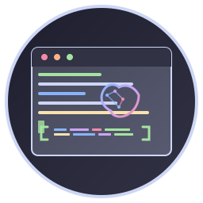

# Open Interpreter GUI

A modern, feature-rich GUI interface for AI-powered code analysis and development assistance, integrated with Ollama and Warp AI features.



## Features

### 🤖 AI-Powered Code Analysis
- **Multi-model Support**: Automatically selects appropriate AI models based on project language and complexity
- **Smart Analysis**: Detects bugs, suggests optimizations, and provides concrete fixes with line numbers
- **Streaming Progress**: Real-time progress updates with cancellation support
- **Timeout Protection**: Intelligent timeout handling to prevent long-running operations

### 🔧 Comprehensive Development Tools
- **Code Analysis**: Deep code review with specific recommendations
- **Bug Detection**: Identifies potential issues with exact locations
- **Auto-fixing**: Suggests and applies code fixes
- **Testing**: Generates and runs tests for your code
- **Optimization**: Performance and efficiency improvements
- **Documentation**: Automatic code documentation generation
- **Build & Run**: Integrated build and execution tools

### 🎯 Warp AI Integration
- **Command Generation**: AI-powered terminal command suggestions
- **Command Explanations**: Detailed explanations of complex commands
- **Context-aware**: Understands your project structure and requirements

### 🎨 Modern UI/UX
- **Clean Interface**: Intuitive design with organized button layout
- **Progress Tracking**: Visual progress bars and status updates
- **Error Handling**: Graceful error recovery and user feedback
- **Responsive Design**: Adapts to different screen sizes

## Installation

### Prerequisites
- Python 3.8 or higher
- Ollama installed and running
- Required Python packages (see requirements.txt)

### Quick Install

```bash
# Clone the repository
git clone <repository-url>
cd open_interpreter_gui

# Install dependencies
pip install -r requirements.txt

# Run the application
python main.py
```

### Arch Linux Package

For Arch Linux users, a PKGBUILD is available:

```bash
# Build and install package
makepkg -si
```

## Usage

### Getting Started

1. **Launch the Application**
   ```bash
   python main.py
   ```

2. **Select Your Project**
   - Click "Browse" to select your project directory
   - The application will automatically detect the project language

3. **Choose Your Task**
   - Use the comprehensive button panel to select your desired operation
   - Each button is optimized for specific development tasks

### Available Operations

#### Analysis & Quality
- **Analyze**: Comprehensive code analysis with detailed feedback
- **Find Bugs**: Specific bug detection with exact line numbers
- **Fix Issues**: Automatic code fixing with before/after examples
- **Optimize**: Performance and efficiency improvements

#### Development & Testing
- **Test**: Generate and run comprehensive tests
- **Build**: Compile and build your project
- **Run**: Execute your application
- **Document**: Generate detailed code documentation

#### AI Commands
- **Warp AI Commands**: Access AI-powered command generation and explanations

### Model Selection

The application automatically selects the most appropriate AI model based on your project:

- **C++**: MagiCoder for complex projects, CodeLlama for simpler ones
- **Python**: Qwen2.5-Coder for complex projects, CodeLlama for others
- **JavaScript/TypeScript**: CodeGemma or StarCoder2
- **Rust**: StarCoder2 specialized for Rust
- **Go**: CodeGemma optimized for Go
- **Default**: CodeLlama for general-purpose coding

### Configuration

#### Ollama Setup
Ensure Ollama is running with your preferred models:

```bash
# Install recommended models
ollama pull codellama
ollama pull magicoder
ollama pull qwen2.5-coder
ollama pull codegemma
ollama pull starcoder2
```

#### Environment Variables
- `OLLAMA_HOST`: Ollama server URL (default: http://localhost:11434)
- `WARP_AI_ENABLED`: Enable/disable Warp AI features (default: true)

## Advanced Features

### Custom Prompts
The application uses sophisticated prompts designed to extract specific, actionable feedback:

- **Concrete Analysis**: Demands specific line numbers and exact issues
- **Before/After Examples**: Provides clear code transformation examples
- **Contextual Understanding**: Considers project structure and dependencies

### Error Handling
- **Server Errors**: Graceful handling of Ollama 500 errors
- **Timeout Management**: Intelligent timeout with user feedback
- **Progress Cancellation**: Clean cancellation of long-running operations

### Performance Optimization
- **Prompt Size Limiting**: Prevents oversized API requests
- **File Filtering**: Focuses on relevant code files
- **Streaming Support**: Real-time progress updates

## Troubleshooting

### Common Issues

#### Ollama Connection Errors
```bash
# Check if Ollama is running
ollama list

# Start Ollama service
systemctl start ollama
```

#### Model Not Found
```bash
# Pull missing model
ollama pull <model-name>
```

#### Timeout Issues
- Large projects may require patience during initial analysis
- Use the cancel button to stop long-running operations
- Consider analyzing smaller portions of your codebase

#### Permission Errors
```bash
# Ensure proper permissions
chmod +x main.py
```

## Development

### Project Structure
```
open_interpreter_gui/
├── main.py              # Main application entry point
├── assets/
│   ├── icon.svg         # Application icon (SVG)
│   └── icon.png         # Application icon (PNG)
├── requirements.txt     # Python dependencies
├── README.md           # This documentation
└── PKGBUILD           # Arch Linux package build script
```

### Contributing
1. Fork the repository
2. Create a feature branch
3. Make your changes
4. Test thoroughly
5. Submit a pull request

### Dependencies
- `tkinter`: GUI framework
- `requests`: HTTP client for Ollama API
- `threading`: Concurrent processing
- `json`: Data serialization
- `os`, `subprocess`: System integration

## License

This project is open source. See LICENSE file for details.

## Support

For issues, questions, or contributions:
- Check the troubleshooting section
- Review existing issues
- Create a new issue with detailed information

## Changelog

### Latest Version
- ✅ Multi-model AI support with intelligent selection
- ✅ Comprehensive development tool suite
- ✅ Warp AI command integration
- ✅ Streaming progress with cancellation
- ✅ Advanced error handling and timeout management
- ✅ Modern UI with intuitive button layout
- ✅ Smart prompt engineering for concrete results
- ✅ Project-aware analysis and suggestions

---

## Detailed Functionality

### Main Window
The main window provides access to:
- **ChatWidget**: Facilitates user interaction with AI, sending and receiving messages.
- **ModelConfigWidget**: Allows AI model selection and status checking for Ollama integration.
- **FileManagerWidget**: Manages file navigation and selection within projects.
- **InterpreterWorker**: Manages the process of AI-driven code analysis and suggestions.

### ChatWidget
A sophisticated widget for displaying and sending chat messages.
- **Message Input**: Type and send commands directly.
- **Quick Command Input**: Execute terminal commands instantly.
- **Signal Emission**: Responds to user interactions and emits signals for command handling.

### ModelConfigWidget
Handles configuration for selecting and managing AI models.
- **Model Selection**: Drop-down for choosing AI models based on project requirements.
- **Status Check**: Check if Ollama services are running and available.

### FileManagerWidget
Provides file browsing capabilities and project directory management.
- **File Tree**: Displays directory structures to select files.
- **File Selection**: Allows opening and editing of files, triggering code analysis.

### InterpreterWorker
Core component for executing AI operations and fetching analysis.
- **Process Management**: Handles AI model execution and results retrieval.
- **Signal Handling**: Emits signals for various operation states like completion, errors, etc.

### Advanced Usage
The application is designed to support extensive customizations and integrations.
Follow the developer guide for in-depth customization and contribution details.

**Built with ❤️ for developers who want AI-powered coding assistance**
