> [!IMPORTANT]
> 👋 Hello and welcome to all the new users! Expect things to take a little
> longer than normal to load while the server is busy catching up to all the
> new libraries.
>
> The S—— team isn't willing to provide any assistance to ensure a successful
> handoff of the project. If time permits I will try to publish some R—— images
> which use this metadata provider by default. That should serve as a
> sufficient stopgap until Chaptarr is more widely available.

# 🤓 rreading-glasses [](https://discord.gg/Xykjv87yYs)

Corrective lenses for curmudgeonly readars in your life.

tl;dr: [follow these instructions](#usage).

This is a drop-in replacement for R——'s metadata service. It works with your
existing R—— installation, it's backwards-compatible with your library, and it
takes only seconds to enable or disable. You can use it permanently, or
temporarily to help you add books the R—— service doesn't have yet.

Unlike R——'s proprietary service, this is much faster, handles large authors,
has full coverage of G——R—— (or Hardcover!), and doesn't take months to load
new books. A hosted instance is available at `https://api.bookinfo.pro` but it
can also be self-hosted.

```mermaid
graph LR;
    R[R——]-.->M[official metadata];
    R--> api.bookinfo.pro;

    classDef dotted stroke-dasharray:2,text-decoration:line-through;
    class M dotted;
```



> [!IMPORTANT]
> This is not an official project and is still in progress. Reach out
> to me directly if you have questions or need help, please don't bother the R——
> team.

As of July 2025 there are ~4500 users of the shared instance. Here's what some
of them have said so far:

> Man this is wayyyyyy better than the inhouse metadata, thank you!!

> This is fucking awesome, thank you!!!

> I just added this, and omg it fixed so many issues i've been having! Thank
> you!

> Holy shit can I just say this is so much better.

> This is fucking fantastic. Came across your link, thought hmm I bet this'll
> be crap. Reinstalled R, added your site, instantly found the 5 upcoming books
> that I couldn't. thank you!

> Already had it pull in an extra book from an author that came out in September
> that wasn't originally found!
> Will definitely be a rreading glasses evangalist! haha

> My arr instance has been switched over since yesterday, and it really has
> cleaned up that instance. I've been getting a lot of use out of it.

> it worked! thanks my man, my wife will be happy with this

> Thanks so much for putting this together again, I can't tell you how much I appreciate it!

## Usage

> [!CAUTION]
> This **will** modify your library's metadata, but it won't modify files on
> disk. In any case, __please__ back up your database _and confirm you know how
> to restore it_ before experimenting with this.

Navigate to `http(s)://<your instance>/settings/development`. This page isn't
shown in the UI, so you'll need to manually enter the URL.

Update `Metadata Provider Source` with `https://api.bookinfo.pro` if you'd like
to use the public instance. If you're self-hosting use your own address.

Click `Save`.


You can now search and add authors or works not available on the official
service.

If at any point you want to revert to the official service, simply delete the
`Metadata Provider Source` and save your configuration again. Any works you
added should be preserved.

> [!IMPORTANT]
> Metadata is periodically refreshed and in some cases existing files may
> become unmapped (see note above about subtitles). You can correct this from
> `Library > Unmapped Files`, or do a `Manual Import` from an author's page.

### Before / After


## Self-hosting

An image is available at
[`blampe/rreading-glasses`](https://hub.docker.com/r/blampe/rreading-glasses).
It requires a Postgres backend (any version), and its flags currently look like this:

```
Usage: rreading-glasses serve --upstream=STRING --hardcover-auth=STRING [flags]

Run an HTTP server.

Flags:
  -h, --help                                             Show context-sensitive help.

      --postgres-host="localhost"                        Postgres host ($POSTGRES_HOST).
      --postgres-user="postgres"                         Postgres user ($POSTGRES_USER).
      --postgres-password=STRING                         Postgres password ($POSTGRES_PASSWORD).
      --postgres-password-file=POSTGRES-PASSWORD-FILE    File with the Postgres password ($POSTGRES_PASSWORD_FILE).
      --postgres-port=5432                               Postgres port ($POSTGRES_PORT).
      --postgres-database="rreading-glasses"             Postgres database to use ($POSTGRES_DATABASE).
      --verbose                                          increase log verbosity ($VERBOSE)
      --port=8788                                        Port to serve traffic on ($PORT).
      --rpm=60                                           Maximum upstream requests per minute ($RPM).
      --cookie=STRING                                    Cookie to use for upstream HTTP requests ($COOKIE).
      --cookie-file=COOKIE-FILE                          File with the Cookie to use for upstream HTTP requests ($COOKIE_FILE).
      --proxy=""                                         HTTP proxy URL to use for upstream requests ($PROXY).
      --upstream=STRING                                  Upstream host (e.g. www.example.com) ($UPSTREAM).
      --hardcover-auth=STRING                            Hardcover Authorization header, e.g. 'Bearer ...' ($HARDCOVER_AUTH)
      --hardcover-auth-file=HARDCOVER-AUTH-FILE          File containing the Hardcover Authorization header, e.g. 'Bearer ...' ($HARDCOVER_AUTH_FILE)
```

Two docker compose example files are included as a reference:
`docker-compose-gr.yml` and `docker-compose-hardcover.yml`.

The app will use as much memory as it has available for in-memory caching, so
it's recommended to run the container with a `--memory` limit or similar.

### G——R—— Cookie

When using the G——R—— image ("latest" tag) it's highly recommended that you set
the `cookie` flag for better performance, otherwise new author lookups will be
throttled to 1 per minute. (These requests don't scrape metadata – they simply
resolve canonical IDs. They are only needed the first time an author or book is
fetched.)

* Open a Private/Incognito window in your browser.
* Go to G——R——.
* Create an account or login to your existing account, checking the box to `Keep me signed in`.
* Open Developer Tools (usually with `F12`) and go to the `Network` tab.
* Refresh the page.
* Right click on the first row of `g——r——.com`.
* Select `Copy`/`Copy Value` > `Copy as cURL`.
* Paste it into a plain text editor.

```
curl 'https://www.g——r——.com/'
    ...
    -H 'Cookie: <you want everything in here>'
    ...
```
* Grab everything after `Cookie:` up to, but not including, the trailing `'`.
* If the last character of the string is a semi-colon (`;`), remove this as well.
* Use this as the `--cookie` flag.

#### Example G——R—— Docker Compose Snippet

> \- --cookie=ccsid=foo; ...; lc-main=en_US

### Hardcover Auth

When using Hardcover you must set the `hardcover-auth` parameter (this is optional with G——R——).

* Create an account or login to [Hardcover](https://hardcover.app).
* Click on User Icon and Settings.
* Select `Hardcover API`.
* Copy the entire token **including** `Bearer`.
* Use this as the `--hardcover-auth` flag.

#### Example Hardcover Docker Compose Snippet

> \- --hardcover-auth=Bearer Q123AbC...

### Resource Requirements

Resource requirements are minimal; a Raspberry Pi should suffice. Storage
requirements will vary depending on the size of your library, but in most cases
shouldn't exceed a few gigabytes for personal use. (The published image doesn't
require any large data dumps and will gradually grow your database as it's
queried over time.)

### Troubleshooting

When in doubt, make sure you have the latest image pulled: `docker pull
blampe/rreading-glasses:latest` or `blampe/rreading-glasses:hardcover`.

If you suspect data inconsistencies, try removing R——'s `cache.db` file and
then restart the app.

You can also try deleting your Postgres database to ensure you don't have any
bad data cached.

If these steps don't resolve the problem, please create an issue!

## Key differences

I have deviated slightly from the official service's behavior to make a couple
of, in my opinion, quality of life improvements. These aren't due to technical
limitations and can be changed, so I'm eager to hear if people think these are
an improvement or if it would be better to match the official behavior more
exactly.

- Titles no longer automatically include subtitles _unless_ it's part of a
  series, or if multiple books have the same primary title. This de-clutters
  the UI, cleans up the directory layout, and improves import matching but
  __you may need to re-import some works with long subtitles__. I think the
  trade-off is worth it but others might disagree — let me know!

- The "best" (original) edition is always preferred to make cover art more
  consistently high-quality. Additionally, books are no longer returned with
  every edition ever released, because that makes manual edition selection
  difficult to impossible. Instead, an alternative edition (e.g. translation)
  is only included once at least one user has searched for it. (This might
  change in the future to include all editions but de-duplicated by title.)

## Details

This project implements an API-compatible, coalescing read-through cache for
consumption by the R—— metadata client. It is not a fork of any prior work.

The service is pluggable and can serve metadata from any number of sources: API
clients, data dumps, OpenLibrary proxies, scrapers, or other means. The
interface to implement is:

```go
type Getter interface {
    GetWork(ctx context.Context, workID int64) (*WorkResource, error)
    GetAuthor(ctx context.Context, authorID int64) (*AuthorResource, error)
    GetBook(ctx context.Context, bookID int64) (*WorkResource, error)
}
```

In other words, anything that understands how to map a G——R—— ID to a Resource
can serve as a source of truth. This project then provides caching and API
routes to make that source compatible with R——.

There are currently two sources available: [Hardcover](https://hardcover.app)
and G——R——. A summary of their differences is below.

|                   | G——R——                                                                                                                             | Hardcover                                                                                                                                                                                                                       |
| --                | --                                                                                                                                 | -------------                                                                                                                                                                                                                   |
| Summary           | A slightly faster provider which makes all of G——R—— available, including large authors and books not available by default in R——. | Slightly slower and makes _most_ of Hardcover's library available, as long as their metadata includes a G——R—— ID. This is a smaller data set, but it might be preferable due to having fewer "junk" books.                     |
| New releases?     | Supported                                                                                                                          | Supported                                                                                                                                                                                                                       |
| Large authors?    | Supported                                                                                                                          | Supported, but authors include only 20 (max) books by default for now. New books can be added by manually searching.                                                                                                            |
| Source code       | Public                                                                                                                             | Public                                                                                                                                                                                                                          |
| Performance       | 3RPS (with query batching)                                                                                                         | 1RPS (with query batching)                                                                                                                                                                                                      |
| Stability         | Stable. Nearly identical behavior to official R—— metadata.                                                                        | Experimental and probably more appropriate for new libraries. ID mappings are likely to not exactly match with existing libraries. Series data likely to be incomplete                                                          |
| Hosted instance   | `https://api.bookinfo.pro`                                                                                                         | Coming soon!                                                                                                                                                                                                                    |
| Self-hosted image | `blampe/rreading-glasses:latest`                                                                                                   | `blampe/rreading-glasses:hardcover`                                                                                                                                                                                             |

Please consider [supporting](https://hardcover.app/supporter) Hardcover if you
use them as your source. It's $5/month (or $50/year) and the work they are doing to break
down the G——R—— monopoly is commendable.

Postgres is used as a backend but only as a key-value store, unlike the
official server which performs expensive joins in the request path.
Additionally large authors (and books with many editions) are populated
asynchronously. This allows the server to support arbitrarily large resources
without issue.

## Contributing

This is primarily a personal project that fixes my own workflows. There are
almost certainly edge cases I haven't accounted for, so contributions are very
welcome!

### TODO

- [ ] (QOL) Ignore works/editions without publisher to cut down on
      self-published ebook slop.
- [ ] (QOL) Update R—— client to send `Accept-Encoding: gzip` headers.

## Disclaimer

This software is provided "as is", without warranty of any kind, express or
implied, including but not limited to the warranties of merchantability,
fitness for a particular purpose and noninfringement.

In no event shall the authors or copyright holders be liable for any claim,
damages or other liability, whether in an action of contract, tort or
otherwise, arising from, out of or in connection with the software or the use
or other dealings in the software.

This software is intended for educational and informational purposes only. It
is not intended to, and does not, constitute legal, financial, or professional
advice of any kind. The user of this software assumes all responsibility for
its use or misuse.

The user is free to use, modify, and distribute the software for any purpose,
subject to the above disclaimers and conditions.
